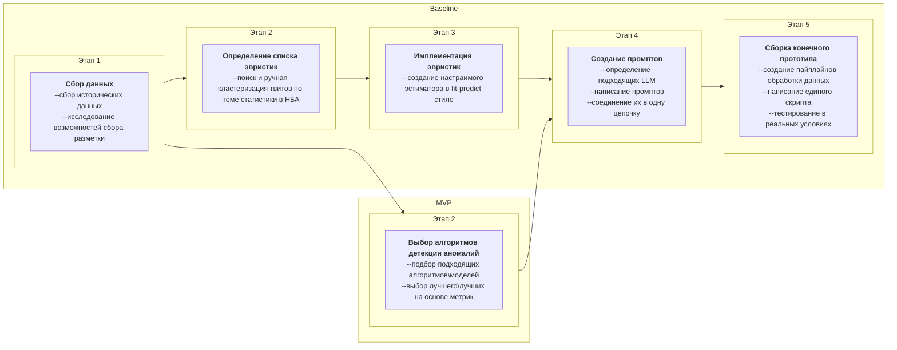

# ML System Design Doc - [RU]
## Дизайн ML системы - BASNya MVP #1

### 0. Meta
- Разные разделы этого документа написаны от лица 2х "персонажей":
  1. Product Owner - `PO` - Nick - вымышленный дата-журналист, который с помощью python-стека анализирует статистику НБА и постит найденные интересные факты (преимущественно) в твиттер 
  2. Data Scientist - `DS` - Алексей
- MVP #1 - фактически одна большая фаза discovery и не предполагает внедрения и удобного UI
- *Сделано по Шаблону ML System Design Doc от телеграм-канала [Reliable ML](https://t.me/reliable_ml)*
- Графы нарисованы через [mermaid](https://mermaid.live/edit)
- Таблицы конвертированы в markdown [так](https://tabletomarkdown.com/convert-spreadsheet-to-markdown/)

### 1. Цели и предпосылки 
#### 1.1. Зачем идем в разработку продукта?  

- Бизнес-цель `PO`: 

Сократить время и усилия, затрачиваемые на анализ только что закончившихся матчей и написание текста новости\твита; охватить большее количество игр, игроков и клубов
- Почему станет лучше, чем сейчас, от использования ML `PO` & `DS`: 

Уменьшение рутинных операций, уменьшение задержки между окончанием игры и выходом твита о ней, увеличение количества твитов  
- Что будем считать успехом итерации с точки зрения бизнеса `PO`: 

Инструмент, который позволяет в течение 1 часа после окончания игры НБА получить 3+ идеи для твита  

#### 1.2. Бизнес-требования и ограничения `PO`   
Текущий бизнес-процесс: 

1. дата-журналист внимательно смотрит игру и по ходу формирует гипотезы для потенциальной новости
2. после окончания игры собирает необходимые данные и проводит их анализ, проверяет гипотезы
3. формулирует текст твита на основе одной из гипотез

Бизнес-процесс после окончания данной итерации (он же основной use case):
1. после окончания игры дата-журналист запускает Инструмент, который выдаёт 
    - список потенциально интересных стат. фактов 
    - вариант текста твита для каждого факта
    - доказательства правдивости этого факта
2. дата-журналист выбирает 1+ факт и готовит на его основе твит (возможно проведя доп. анализ\валидацию вручную)

* Бизнес-ограничения `PO`:
    * поддержание инфраструктуры проекта обходится меньше, чем в $50\мес.
    * время работы скрипта - не более 1 часа
    * (опционально) прозрачность того, какой именно срез исторических данных был использован для каждого факта
    * (опционально) возможность выбора разреза данных: сезон НБА в целом, сезон клуба, несколько последних сезонов клуба, сезон игрока, карьера игрока

* Критерии успеха `PO`: на дистанции в 1 игровую неделю (~50 игр) применение скрипта позволяет написать 3 твита с минимальной ручной доработкой и 1 твит с доп. ручным исследованием  
 

#### 1.3. Что входит в скоуп проекта/итерации, что не входит   

* На закрытие каких БТ подписываемся в данной итерации `DS`: 
  * создание пайплайна данных
  * определение алгоритмов для выделения фактов-кандидатов
  * генерация текста твита по заданному факту
  * создание инструмента для запуска с минималистичным UI   
- Что не будет закрыто `DS`: 
  - доказательство корректности выдаваемых вариантов  
  - возможность выбора разреза данных
- Описание результата с точки зрения качества кода и воспроизводимости решения `DS`: код разбит на функциональные модули (сбор данных, формирование фактов-кандидатов, генерация текста), модели\алгоритмы\промпты версионируются  
- Описание планируемого технического долга (что оставляем для дальнейшей продуктивизации) `DS`: более удобный UI, развёрнутая документация

#### 1.4. Предпосылки решения `DS`: 

- есть открытые данные за много сезонов на stats.nba
- простых эвристических правил будет достаточно для создания MVP
- возможностей и лимитов chatGPT3.5, которая доступна бесплатно, достаточно, чтобы обработать несколько игр за приемлемое время
- наличие открытых датасетов и науч. работ по ним по теме генерации текста на именно баскетбольных данных: 
  - https://paperswithcode.com/dataset/rotowire
  - https://paperswithcode.com/dataset/sportsett

### 2. Методология `DS`     

#### 2.1. Постановка задачи  `DS`

- аналитика, на основе исторических данных
- поиск аномалий (именно аномалий, не новизны)
- генеративная текстовая модель

#### 2.2. Блок-схема решения  `DS`

- Блок-схема для бейзлайна и основного MVP с ключевыми этапами решения задачи:

#### 2.3. Этапы решения задачи `DS`  

###### Этап 1. Сбор данных
На основе stats.nba.com собираем в БД такие данные за последние 5 сезонов:

| Название данных                                                   | Есть ли данные в компании | Ресурс и роли\\права, нужные для получения данных | Проверено ли качество данных (да, нет) |
|-------------------------------------------------------------------|---------------------------|---------------------------------------------------|----------------------------------------|
| games - игры НБА за последние Н сезонов                           | нет                       | портал stats.nba.com                              | нет                                    |
| players_0 - данные об игроках за последние Н сезонов              | нет                       | портал stats.nba.com                              | нет                                    |
| boxscoretraditionalv2_0 - стат. протокол для каждой игры из games | нет                       | портал stats.nba.com                              | нет                                    |

Примечание: портал stats.nba.com доступен через публичный api и не требует особых прав\креденшиалов

Результат этапа: 
- исторические данные доступные на момент начала этапа загружены таблицы 
- есть пайплайн сбора недостающих данных (для только что сыгранных матчей), который можно запускать вручную

###### Этап 2. Определение списка эвристик
Процесс: 
1. поиск подходящих источников гуглением 
2. выделение приоритетных источников (твиттеры, субреддиты) 
3. скрапинг результатов из них за последние Н лет 
4. ручная разметка на классы:
    * простая аномальная статистика игрока
    * сложная аномальная статистика игрока 
    * не релевантно текущей итерации, но может быть полезно в будущем
    * не релевантно задаче вообще

**(простое требует одного показателя, который уже есть или может быть легко рассчитан, сложное - всё остальное)**

Результат этапа: 
- описано 5+ источников необычной статистики игроков
- собрано 100+ примеров аномальной статистики игроков
- сформулировано 10+ правил-эвристик для определения "простой" аномальной статистики игроков и 5+ правил - для "сложной" 

###### Этап 3. Имплементация эвристик
Процесс:
1. создание для каждого правила класса\функции, который по новой игре и историческим данным ищет аналогичные этому правилу аномалии 
2. приведение всех классов к единому интерфейсу
3. прогон всех классов на исторических данных (на предыдущем сезоне) и EDA полученных результатов 
4. создание эстиматора в fit-predict стиле, который объединяет настраиваемый набор из этих классов
5. определение оптимального набора на основе EDA из п.3

Результат этапа: есть класс-эстиматор, определяющий для статистической линейки игрока в "новой" игре, является она аномалией или нет 

###### Этап 2 (MVP). Выбор алгоритмов детекции аномалий
Процесс:
1. На основе данных, собранных на этапе 1, обучается несколько unsupervised детекторов аномалий
2. Для каждого детектора применяется методы интерпретации, чтобы для каждого предсказания можно было сказать, какие именно показатели являются аномальными
3. Делается выбор о лучшей связке модель+интерпретация

Результат этапа: 
- выбран класс моделей и метод интерпретации
- есть скрипт для обучения этой модели на актуальных данных
###### Этап 4. Создание промптов

Процесс:
* написание промптов по генерации твита
  * в т.ч. с учётом БТ о прозрачности среза использованных данных
* (если необходимо) создание агентов по поиску в имеющейся БД
* соединение промптов в одну цепочку
* выбор подходящих LLM 
  * скорее всего, выбор между доступными моделями openai на основе субъективного трейдоффа цена-качество
  * или решение о необходимости файнтюна под свои нужды

Результат этапа: есть модуль, который на основе выходных результатов эстиматора генерирует текст твита 

###### Этап 5. Сборка конечного прототипа

Процесс:
- создание пайплайнов обработки данных
- написание streamlit приложения
- тестирование в реальных условиях
- оценка количества сгенерированных твитов (объективная метрика), из разнообразия (метрика, которую можно формализовать) и качества (субъективная)

Результат этапа: приложение работает в условиях приближенных к реальным
  
### 3. Подготовка пилота  `DS`
  
#### 3.1. Способ оценки пилота  
  
Пилот: 
- на промежутке в 1 неделю после каждой закончившейся игры НБА вручную запускается скрипт и сохраняются его результаты
- результаты просматриваются вручную `PO` для выделения "почти-готовых" твитов и потенциально интересных тем для доп. исследования

#### 3.2. Что считаем успешным пилотом `PO`  
1. скрипт при каждом запуске выдаёт или релевантный список фактов\твитов или сообщение о недоступности необходимых сервисов
2. среди полученных результатов есть материал для
   - 3х твитов с минимальной ручной доработкой 
   - 1 твита с доп. ручным исследованием 
#### 3.3. Подготовка пилота  

Если есть готовый скрипт и БД с историческими данными, то для подготовки пилота достаточно просто дождаться начала сезона НБА  

### 4. Внедрение     

Текущая итерация:
1. ограничивается только деплоем streamlit приложения в облако
2. не предполагает разделения на production и не-production системы

Инструкция по деплою - how_to_deploy.md

Инструмент предполагает использование 1 пользователем, поэтому нет необходимости учитывать пиковые нагрузки. 

Достаточно, чтобы приложение, развёрнутое в Streamlit Community Cloud успешно выполнялось менее, чем за час. На имитационных запусках это требование выполнялось.

Масштабирования системы не предполагается, соответственно нет необходимости в нагрузочном тестировании

