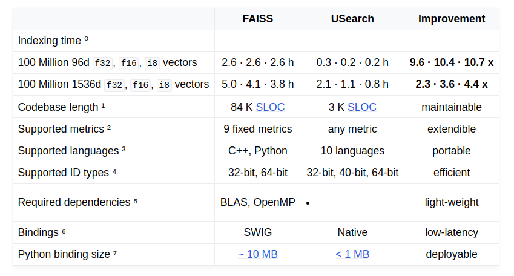

Статья написана в рамках курса https://ods.ai/tracks/ml-system-design-23 и опубликована здась - https://telegra.ph/USearch---bystraya-vektornaya-BD-12-30

# USearch - быстрая векторная БД

## Описание

USearch - это движок для индексации векторов и поиска ближайших соседей. Этот движок можно использовать как быструю векторную БД.

Это именно БД, а не СУБД. Добавлять, изменять, искать и просматривать записи можно только программно. Никаких средств для бэкапа и масштабирования.

Встроена в облачную платформу https://www.unum.cloud

## Основные особенности и сценарии использования

Основной сценарий: посчитали эмбеддинги для большого объёма данных, проиндексировали их с помощью `usearch` => получили БД, где можно искать записи по степени близости к эмбеддингу-запросу. 
1. Поиск по умолчанию приближённый (т.е. ищем похожие векторы), но есть и опция поиска точного совпадения.
2. Можно сохранить индекс на диск и тогда не обязательно держать его целиком в RAM => меньше требования к машине, на которой будет работать БД => потенциальная экономия
3. Можно использовать несколько отдельных индексов при поиске как единый индекс => нет необходимости создавать один гигантский индексный файл
4. Можно искать похожие векторы сразу для батча эмбеддингов-запросов => будет быстрее, чем по одному за раз
5. Метрики близости векторов из коробки: IP (скалярное произведение), Cos, L2sq (евклидово расстояние), Haversine, Pearson, Hamming, Tanimoto, Sorensen
6. Возможность скомпилировать кастомную метрику
7. Возможность сматчить 2 индекса в соответствии с задачей о марьяже (https://ru.wikipedia.org/wiki/Задача_о_марьяже). Это некоторый аналог операции `JOIN` из SQL.
8. Есть версии для C++, Python, JS, Rust, C#, Swift
9. Позволяет работать с разной точностью: Float32, Float16, Int8

Побочный сценарий - можно кластеризовать эмбеддинги и анализировать получившиеся кластеры.

## Альтернативы и сравнение с ними по производительности 

Появилось много новый чисто векторных БД + добавились возможность векторного поиска в некоторые существующие БД (PostgresSQL, Elasticsearch и Cassandra).
Для них есть много сравнений (например https://benchmark.vectorview.ai/vectordbs.html). Но USearch в эти сравнения не попадает, возможно из-за нишевости и малой популярности.

Поэтому авторы сделали своё сравнение с библиотекой от Facebook FAISS (https://faiss.ai): 
https://www.unum.cloud/blog/2023-11-07-scaling-vector-search-with-intel

В этом сравнении репортят, что их индексация работает от 2 до 10 раз быстрее в зависимости от размерности и количества векторов, а поиск - в сотни раз быстрее. 




### Причины выигрыша по скорости

Ядро написано на C и использует близкие к теоретико-оптимальным структуры данных. В отличие от FAISS, где C++ и структуры данных из STL. 

Дополнительно использовалась кастомная оптимизация кодогенерации под конкретные архитектуры ЦП для функций, который считают рсстояние\метрики - https://github.com/ashvardanian/simsimd.  


## Пример кода

Чтобы посчитать 58К эмбеддингов длины 768 для текстов длиной в пределах 512 слов, потребовалось ~30 минут на CPU:

```python
from sentence_transformers import SentenceTransformer

model = SentenceTransformer('thenlper/gte-base', device='cpu')
_emb768 = model.encode(df.txt.tolist(), show_progress_bar=True, device='cpu') 
```

На то, чтобы их проиндексировать, ушло всего 6 секунд (!) 
```python
from usearch.index import Index

index = Index(ndim=768)  # метрика по умолчанию - косинусное расстояние
_inserted = index.add(df.index.values, _emb768)
```

Поиск ближайших соседей:
```python
matches = index.search(_emb768_search, count=5)
df.loc[np.unique(matches.keys)]
```

Полный пример - https://github.com/no-one2k/basnya/blob/ba4e8c52b418cee034faff20653137bbbfa14c9f/discovery/tools/usearch/usearch_example.ipynb

## Полезные ссылки

1. Оф. документация https://unum-cloud.github.io/usearch/
2. Описание алгоритма для быстрого поиска ближайших соседей https://arxiv.org/abs/1603.09320
3. Сравнение скорости реализаций алгоритмов приближённого поиска ближайших соседей (ANN) https://ann-benchmarks.com 
